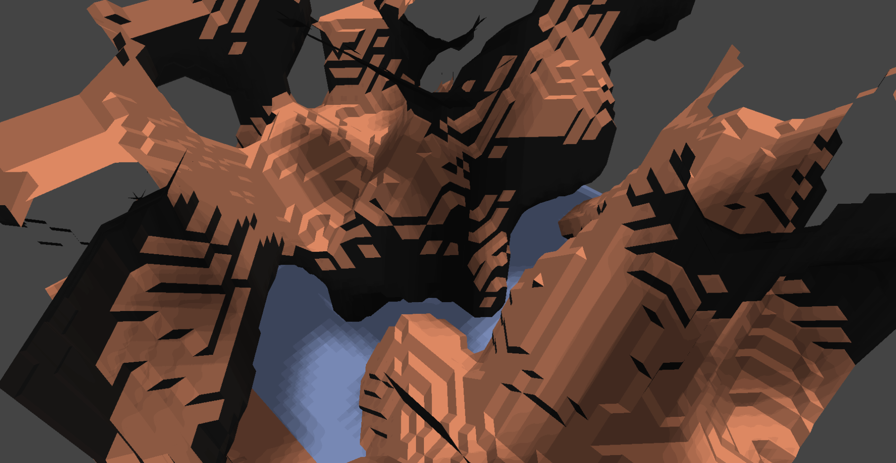
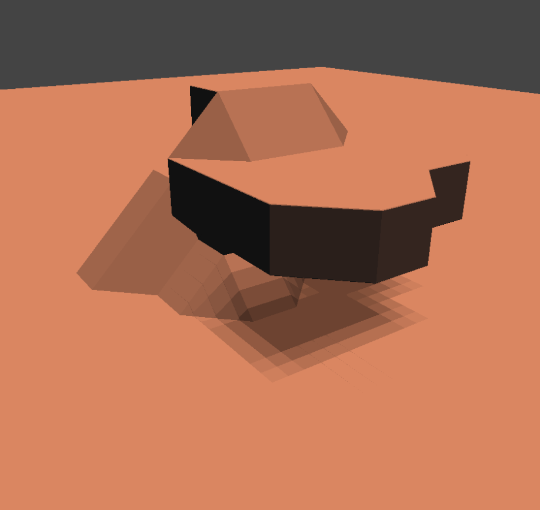

webgl-marchingcubes
===================

A WebGL implementation of the marching cubes algorithm for deformable terrain

##Running the App Right Now

If you just want to take a look, you can do that here: http://www.grantforrest.net/webgl-marchingcubes/index.html

##Running the App Locally

###Prerequisites

If you don't already have a static file serving solution, you'll need [Node.js](http://nodejs.org/). You won't need to install any other packages, though.

First, host the files. You can do this using Node.js and `fileserver.js`, located in the root directory.

    > node fileserver.js
    
This will host the directory on `http://localhost:8888/index.html`. Navigate there to view the scene.

##Controls

Use WASD to move the camera. Use the left mouse button and mouse pan to change the camera angle. Use Q to build a block and E to destroy one.

##Alternate Terrain

To generate the scene with flat terrain instead of Perlin noise, add a hash to the URL: `http://localhost:8888/index.html#flat`.

To generate smoothed terrain, try `#smooth` instead. Personally, I prefer the blocky style, but it's still pretty cool!

##Screenshots

The perlin noise generated terrain version

A simple demonstration of shadows and deformable terrain in the flat generation version.